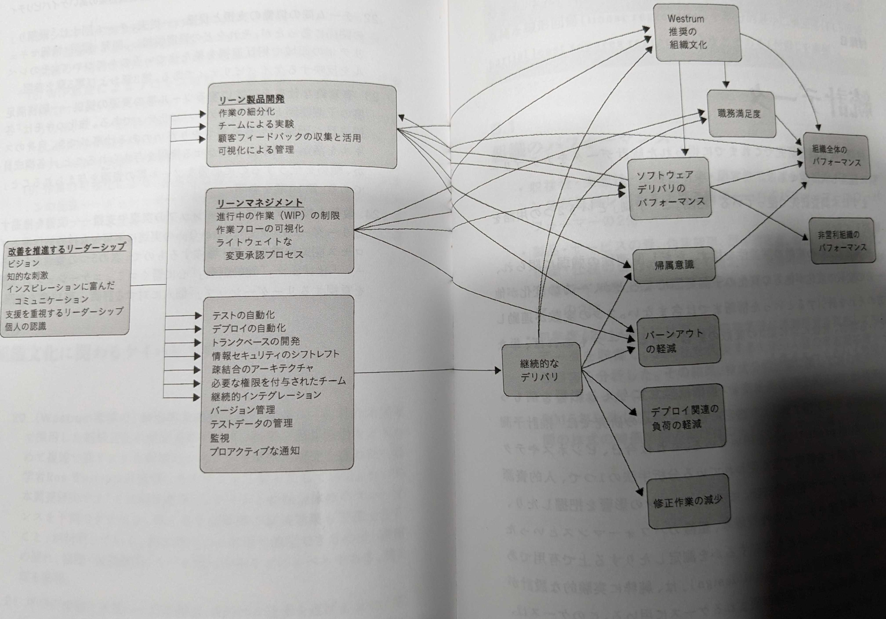

devops_kptの質問シート(9058b78725)
---

eNPS(3332c2e250)

---

## 概要
KPTなどの振り返りには、組織のゴールが設定されていると、どこに向かって振り返るのか？が明確になります。
eNPSなどは、ゴールに向かっているか？を測るための指標ですが、なぜeNPSなどの指標が重要なのか？を理解することが大切です。

## 我々はどこに向かっているのか？
「顧客の事業の成功を支援する」ことが、我々の目指すところです。
- 顧客の競争力の強化

あえて、単純に「コスト削減」とか「利益率向上」とかの分かりやすい目標を設定しません。
その背景には、書籍「経営分析のリアル・ノウハウ」という本からインスパイアというか呼び覚まされた考えですが、DevOpsにも共通する考えです。

引用: book_経営分析のリアル・ノウハウ(a0f13198d5)
>memo31
>顧客経済とは、顧客の購買活動は、コントロールも予想もつかないものではなく、顧客自身の経済性によって、ある程度予測できるものであるという考え方。BtoBであれば顕著であるが、BtoCでも実態をつかめば、顧客経済から、顧客の購買の本質を掴むことはできよう。
>BtoBの内部的な経済性に関わる問題は、自社のコストサイドの競争力・勝ちパターンの裏返しで考えればOK。
>ユーザサイドの経済性（勝ちとコスト）に関わる議論、つまり、同じコスト競争力を持つ会社が複数あったときに、ユーザに届ける価値を構造的に高めることができれば、勝ちである。

「組織のパフォーマンス」をP(Productivity)とし、「組織のパフォーマンスを作る能力」をPC(Productivity Capability)とします。
「P/PCバランスを意識せよ」とは、７つの習慣の前提となる考えです。

成功のためには、金の卵を産むガチョウから、できるだけ沢山の金の卵を絞り取ることではなく、
金の卵を産むガチョウを育てるだけでなく、
金の卵をもらいながら、ガチョウを育てることが重要です。

ですから、「コスト削減」とか「利益率向上」といった分かりやすいPだけを目指すのではなく、
その背景となる能力(Capability)も同時に鍛えることが重要です。

では、その能力とはなにか？
「組織のパフォーマンスを作る能力」とはなにか？

これは、eNPS, DevOps指標など、多岐に渡りますが、計測は困難です。
しかし、計測が困難だからといって、目指さないのは違います。

この方向性は、科学的に正しく、定量的に示すことができない間は、従業員１人１人の人間的な能力を信じ、互いに議論し合う中で、
我々が正しくその方向に向かっているのか？吟味しながら、進んでいきたいと考えています。

つまり、私たちは、進むべき方向を知っているが、正しくその方向に向かっているか？の方位磁針を持ち合わせていないか、脆弱な方位磁針しか持ち合わせていない状況です。
私たちは、進むべき方向と、進んでいる方位が一致しているか？を、議論し合いながら、進んでいきましょう。

## 脆弱な方位磁針
脆弱とはいえ、書籍「LeanとDevOpsの科学」によると、「組織のパフォーマンスを作る能力」として、「24の能力(Capability)」と「構成概念の予測関係（駆動関係）」が示されています。
私たちは、これらの「能力」や「予測関係」を参考にしながらも、私たちの議論によって、より正確な方位磁針を作り上げていきます。

## 方位磁針となる能力や予測関係の整理
### 24の能力
#### 1. 継続的デリバリ
- 本番環境の「すべての」成果物をバージョン管理システムで管理
- デプロイメントプロセスの自動化（の実現度）
- 継続的インテグレーションの実装
- トランクベースの開発手法の実践
  - アクティブなブランチの数は３つ以下
  - フォークの寿命は非常に短い（たとえば１日未満）
  - 開発チームのプルリクエストをストップする期間がほとんどない
- テストの自動化
- テストデータの管理
- 情報セキュリティのシフトレフト（セキュリティチェックは最後ではなく、工程の最初からいれる）
- 継続的デリバリ（CD）の実践（デプロイ可能な状態で維持する）
#### 2. アーキテクチャ
- 疎結合のアーキテクチャ
- チームへのツール選択権限の付与
#### 3. 製品とプロセス
- 顧客フィードバックの収集と活用
- 全業務プロセスの作業フローの可視化
- 作業の細分化
- チームによる実験の奨励・実現
#### 4. リーン志向に基づく管理と監視
- 負担の軽い変更承認プロセス
- 事業場の意思決定における、アプリケーションとインフラの監視結果の活用
- システムの健全性のプロアクティブ（予防的）なチェック
- WIP制限によるプロセス改善と作業管理
- 作業の可視化による、品質の監視とチーム内コミュニケーションの促進
  - ダッシュボードや内部Webサイトを、品質やWIPの監視に活用する
#### 5. 組織文化
- (Westrum推奨の)創造的な組織文化の育成
  - 権力志向（不健全）
  - 官僚的（ルール志向）
  - 創造的（パフォーマンス志向）
    - すべての構成員の間で信頼関係と協力関係が成立している
    - より良い情報に基づいて意思決定できる。情報が間違いであった場合は、すぐに覆せる。
      - 受け手が解消したい疑問に、答えをもたらしてくれる
      - 適切なタイミング
      - 受け手が有効に使える形式
    - チーム内外の関係者との協力体制が整っている
- 学びの奨励と支援
- チーム間の協働の支援と促進
  - Dev | Ops の縦割りを脱却し、相互連携を果たせているレベル
- 有意義な仕事を可能にするツール等の資源の影響
  - 困難でも有意義でやりがいのある仕事
  - 自信のスキルを活かし判断力を働かせる権限を与えられる
  - 各構成意が、職務を全うするのに必要な資源を与えられる
- 改善を促進するリーダーシップの実現や支援
  - ビジョン
    - チームが進む方向を明確に把握しえいる
    - チームが５年後にどうあってほしいかを明確に意識している
    - 組織が進む方向を明確に把握している
  - 心に響くコミュニケーション
    - 組織の一員であることを従業員が誇りに思える発言をする
    - 作業の１つ１つについて前向きな発言をする
    - 環境の変化をチャンスと捉えるように励ましてくれる
  - 知的刺激
    - 新たなやり方で従来の問題に取り組むように促す
    - かつて疑問視したことがない事柄について見直しを迫る見解を示す
    - 仕事上の前提が適切なものかどうかを再考させる
  - 支援を重視するリーダーシップ
    - 個人的な感情を配慮した上で行動する
    - 個人的要望をよく検討して行動する
    - 従業員の興味を十分考慮してくれる
  - 個人に対する評価
    - 平均以上の仕事をすると称えてくれる
    - 仕事の質が向上していると認めてくれる
    - 顕著な業績を上げると、個人的に報奨してくれる

### 予測関係

### 注意
これらの科学的研究成果は、あくまでも「統計的に有意に相関があることが証明された」ものを紹介しているに過ぎず、
「局所的には、相関がない場合もある」とか「統計的には相関が認められないが、局所的には相関がある」というパターンがあることも理解しておく必要があります。

したがって、これらの科学的研究成果を「参考」としつつも、私たちの議論によって、より正確な方位磁針を作り上げていくことが重要です。

## 独自の能力定義
### 1. リモートワーク
- 相手を不安にさせない
- ...
### 2. トヨタ５S

### 3. なんの文化？
- 許可を求めるのではなく、謝罪せよ
- チームワークの考え方が、一般社会と違う
- 仕事の定義
  - 頑張っている感を出す vs 成果を出している
- 仕事は顧客に向かってしなさい
- 現場主義。答えはコードにある。
- 過剰な敬語・丁寧語は、チーム内に権威や上下関係を生むので、避けてください（役割と上下は別だよ！）
- 頑張っているのか・成果を出すのか
- ...その他、上村さんにフィードバックしたことを、抽象化してまとめる
- リーダブルコードを書いているか？
- 監督コメンタリ・お手紙を残しているか？

### 3. 効果的なチームになる
https://rework.withgoogle.com/jp/guides/understanding-team-effectiveness#introduction
Googleの Project アリストテレス 「全体は部分の総和に勝る」の研究結果を参照

#### 効果性に影響する因子と質問
- 心理的安全性
  - Question: 「チームの中でミスをしても、それを理由に非難されることはない」と思えるか。
  - Question: 「無知、無能、ネガティブな意見や、邪魔だと思われる行動をしても、このチームなら大丈夫だ」と思えるか。
- 相互信頼
  - Question: 「チームメンバーは、一度引き受けた仕事は最後までやりきってくれる」と思えるか。
  - Question: 「問題があったときに、責任を転嫁することなく、間違いを認め、問題解決に向かって協力してくれる」と思えるか。
- 構造と明確さ
  - Question: 「チームには、有効な意思決定プロセスがある」と思えるか。
  - Question: 「職務上で要求されていること、その要求を満たすためのプロセス、そして自分の行動がもたらす成果を理解している」と思えるか。
  - Tool: 目標と成果指標（OKR）
- 仕事の意味
  - Question: 「チームのためにしている仕事は、自分自身にとっても意義がある」と思えるか。
- インパクト
  - Question: 「チームの成果が組織の目標達成にどう貢献するかを理解している」か。

#### 効果性に影響しない因子
- チームメンバーの働き場所（同じオフィスで近くに座り働くこと）
- 合意に基づく意思決定
- チームメンバーが外交的であること
- チームメンバー個人のパフォーマンス
- 仕事量
- 先任順位
- チームの規模
- 在職期間

#### 最重要である心理的安全性についての補足
##### 定義 by エイミー エドモンソン氏
「対人関係においてリスクのある行動をしてもこのチームでは安全であるという、チームメンバーによって共有された考え」
##### 説明
チームメンバーに対してリスクのある行動を取ることは、特別難しいことではないと思われるかもしれません。しかし、「このプロジェクトの目標は何ですか？」などのように、ごく基本的な質問をするときのことを想像してみてください。「そんなこともわかっていないのか」とあきれられることへの不安を覚えるのではないでしょうか。無知だと思われないように、質問をせずにやり過ごそうとする人も少なくないはずです。
##### 心理的安全性レベルを調べるための質問
- チームの中でミスをすると、たいてい非難される。
- チームのメンバーは、課題や難しい問題を指摘し合える。
- チームのメンバーは、自分と異なるということを理由に他者を拒絶することがある。
- チームに対してリスクのある行動をしても安全である。
- チームの他のメンバーに助けを求めることは難しい。
- チームメンバーは誰も、自分の仕事を意図的におとしめるような行動をしない。
- チームメンバーと仕事をするとき、自分のスキルと才能が尊重され、活かされていると感じる。
##### 個人にできる３つのアプローチ
[TEDx Talks でのスピーチ](https://youtu.be/LhoLuui9gX8)
- 仕事を実行の機会ではなく学習の機会と捉える。
- 自分が間違うということを認める。
- 好奇心を形にし、積極的に質問する。

#### マネージャーやリーダーができることへのヒント
- 心理的安全性:
  - チームからの意見やアイデアを求める。
  - 個人的な仕事の進め方の好みをチームメンバーに伝え、チームメンバーにも自分自身の好みをチーム内に共有するよう促す。
  - 心理的安全性についてのエイミー エドモンソン氏の TEDx Talks を観る。
- 相互信頼:
  - 各チームメンバーの役割と責任を明確にする。
  - 各メンバーの仕事に透明性をもたらす具体的なプロジェクト計画を策定する。
  - 誠実さに関するリサーチ研究について話し合う。
- 構造と明確さ:
  - チームの目標を定期的に周知し、目標達成のための計画をメンバーに理解させる。
  - チームでミーティングを開く際には、明確な議題を設定し、リーダーを指名する。
  - チームの仕事を整理する「目標と成果指標（OKR）」の導入を検討する。
- 仕事の意味:
  - チームメンバーが効果的に行なっている取り組みに対して好意的なフィードバックを提供し、メンバーが課題に直面している場合には手を差し伸べる。
  - 誰かが自分を助けてくれた場合は、メンバーの前で感謝の気持ちを伝える。
  - 目的意識に関する KPMG の事例を読む。
- インパクト:
  - 各チームメンバーの仕事が、チームや組織の目標達成に貢献するような明確なビジョンを共同で策定する。
  - 自分またはチームの仕事がユーザーや顧客、組織に与える影響をよく考える。
  - ユーザーの目線で物事を評価する仕組みを導入し、ユーザーに焦点を当てる。

#### 資料
- [#03_チーム](https://drive.google.com/drive/folders/1MUxnDPn_2EhBH_MaHmmNfPDsB0XDp6Nl)
