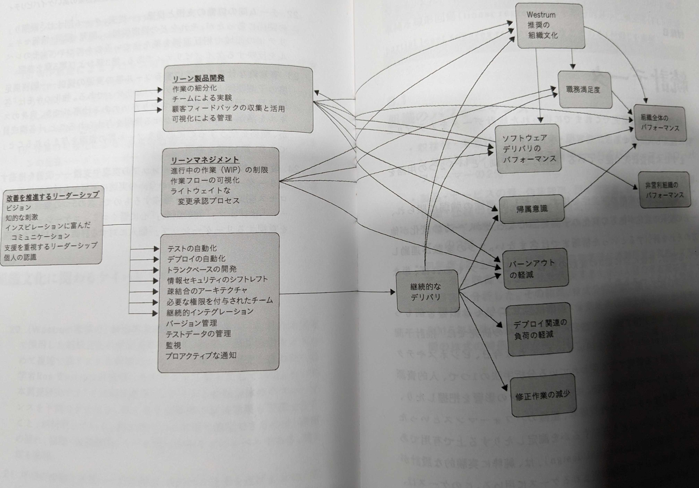

devops_kptの質問シート(9058b78725)
---

eNPS(3332c2e250)

---

## 概要
KPTなどの振り返りには、組織のゴールが設定されていると、どこに向かって振り返るのか？が明確になります。
eNPSなどは、ゴールに向かっているか？を測るための指標ですが、なぜeNPSなどの指標が重要なのか？を理解することが大切です。

## 我々はどこに向かっているのか？
「顧客の事業の成功を支援する」ことが、我々の目指すところです。
- 顧客の競争力の強化

あえて、単純に「コスト削減」とか「利益率向上」とかの分かりやすい目標を設定しません。
その背景には、書籍「経営分析のリアル・ノウハウ」という本からインスパイアというか呼び覚まされた考えですが、DevOpsにも共通する考えです。

引用: book_経営分析のリアル・ノウハウ(a0f13198d5)
>memo31
>顧客経済とは、顧客の購買活動は、コントロールも予想もつかないものではなく、顧客自身の経済性によって、ある程度予測できるものであるという考え方。BtoBであれば顕著であるが、BtoCでも実態をつかめば、顧客経済から、顧客の購買の本質を掴むことはできよう。
>BtoBの内部的な経済性に関わる問題は、自社のコストサイドの競争力・勝ちパターンの裏返しで考えればOK。
>ユーザサイドの経済性（勝ちとコスト）に関わる議論、つまり、同じコスト競争力を持つ会社が複数あったときに、ユーザに届ける価値を構造的に高めることができれば、勝ちである。

「組織のパフォーマンス」をP(Productivity)とし、「組織のパフォーマンスを作る能力」をPC(Productivity Capability)とします。
「P/PCバランスを意識せよ」とは、７つの習慣の前提となる考えです。

成功のためには、金の卵を産むガチョウから、できるだけ沢山の金の卵を絞り取ることではなく、
金の卵を産むガチョウを育てるだけでなく、
金の卵をもらいながら、ガチョウを育てることが重要です。

ですから、「コスト削減」とか「利益率向上」といった分かりやすいPだけを目指すのではなく、
その背景となる能力(Capability)も同時に鍛えることが重要です。

では、その能力とはなにか？
「組織のパフォーマンスを作る能力」とはなにか？

これは、eNPS, DevOps指標など、多岐に渡りますが、計測は困難です。
しかし、計測が困難だからといって、目指さないのは違います。

この方向性は、科学的に正しく、定量的に示すことができない間は、従業員１人１人の人間的な能力を信じ、互いに議論し合う中で、
我々が正しくその方向に向かっているのか？吟味しながら、進んでいきたいと考えています。

つまり、私たちは、進むべき方向を知っているが、正しくその方向に向かっているか？の方位磁針を持ち合わせていないか、脆弱な方位磁針しか持ち合わせていない状況です。
私たちは、進むべき方向と、進んでいる方位が一致しているか？を、議論し合いながら、進んでいきましょう。

## 脆弱な方位磁針
脆弱とはいえ、書籍「LeanとDevOpsの科学」によると、「組織のパフォーマンスを作る能力」として、「24の能力(Capability)」と「構成概念の予測関係（駆動関係）」が示されています。
私たちは、これらの「能力」や「予測関係」を参考にしながらも、私たちの議論によって、より正確な方位磁針を作り上げていきます。

## 方位磁針となる能力や予測関係の整理
### 24の能力
#### 1. 継続的デリバリ
- 本番環境の「すべての」成果物をバージョン管理システムで管理
- デプロイメントプロセスの自動化（の実現度）
- 継続的インテグレーションの実装
- トランクベースの開発手法の実践
  - アクティブなブランチの数は３つ以下
  - フォークの寿命は非常に短い（たとえば１日未満）
  - 開発チームのプルリクエストをストップする期間がほとんどない
- テストの自動化
- テストデータの管理
- 情報セキュリティのシフトレフト（セキュリティチェックは最後ではなく、工程の最初からいれる）
- 継続的デリバリ（CD）の実践（デプロイ可能な状態で維持する）
#### 2. アーキテクチャ
- 疎結合のアーキテクチャ
- チームへのツール選択権限の付与
#### 3. 製品とプロセス
- 顧客フィードバックの収集と活用
- 全業務プロセスの作業フローの可視化
- 作業の細分化
- チームによる実験の奨励・実現
#### 4. リーン志向に基づく管理と監視
- 負担の軽い変更承認プロセス
- 事業場の意思決定における、アプリケーションとインフラの監視結果の活用
- システムの健全性のプロアクティブ（予防的）なチェック
- WIP制限によるプロセス改善と作業管理
- 作業の可視化による、品質の監視とチーム内コミュニケーションの促進
  - ダッシュボードや内部Webサイトを、品質やWIPの監視に活用する
#### 5. 組織文化
- (Westrum推奨の)創造的な組織文化の育成
  - 権力志向（不健全）
  - 官僚的（ルール志向）
  - 創造的（パフォーマンス志向）
    - すべての構成員の間で信頼関係と協力関係が成立している
    - より良い情報に基づいて意思決定できる。情報が間違いであった場合は、すぐに覆せる。
      - 受け手が解消したい疑問に、答えをもたらしてくれる
      - 適切なタイミング
      - 受け手が有効に使える形式
    - チーム内外の関係者との協力体制が整っている
- 学びの奨励と支援
- チーム間の協働の支援と促進
  - Dev | Ops の縦割りを脱却し、相互連携を果たせているレベル
- 有意義な仕事を可能にするツール等の資源の影響
  - 困難でも有意義でやりがいのある仕事
  - 自信のスキルを活かし判断力を働かせる権限を与えられる
  - 各構成意が、職務を全うするのに必要な資源を与えられる
- 改善を促進するリーダーシップの実現や支援
  - ビジョン
    - チームが進む方向を明確に把握しえいる
    - チームが５年後にどうあってほしいかを明確に意識している
    - 組織が進む方向を明確に把握している
  - 心に響くコミュニケーション
    - 組織の一員であることを従業員が誇りに思える発言をする
    - 作業の１つ１つについて前向きな発言をする
    - 環境の変化をチャンスと捉えるように励ましてくれる
  - 知的刺激
    - 新たなやり方で従来の問題に取り組むように促す
    - かつて疑問視したことがない事柄について見直しを迫る見解を示す
    - 仕事上の前提が適切なものかどうかを再考させる
  - 支援を重視するリーダーシップ
    - 個人的な感情を配慮した上で行動する
    - 個人的要望をよく検討して行動する
    - 従業員の興味を十分考慮してくれる
  - 個人に対する評価
    - 平均以上の仕事をすると称えてくれる
    - 仕事の質が向上していると認めてくれる
    - 顕著な業績を上げると、個人的に報奨してくれる

### 予測関係

### 注意
これらの科学的研究成果は、あくまでも「統計的に有意に相関があることが証明された」ものを紹介しているに過ぎず、
「局所的には、相関がない場合もある」とか「統計的には相関が認められないが、局所的には相関がある」というパターンがあることも理解しておく必要があります。

したがって、これらの科学的研究成果を「参考」としつつも、私たちの議論によって、より正確な方位磁針を作り上げていくことが重要です。

## 独自の能力定義
### 1. リモートワーク
- 相手を不安にさせない
- ...
### 2. トヨタ５S

### 3. なんの文化？
- 許可を求めるのではなく、謝罪せよ
- チームワークの考え方が、一般社会と違う
- 仕事の定義
  - 頑張っている感を出す vs 成果を出している

