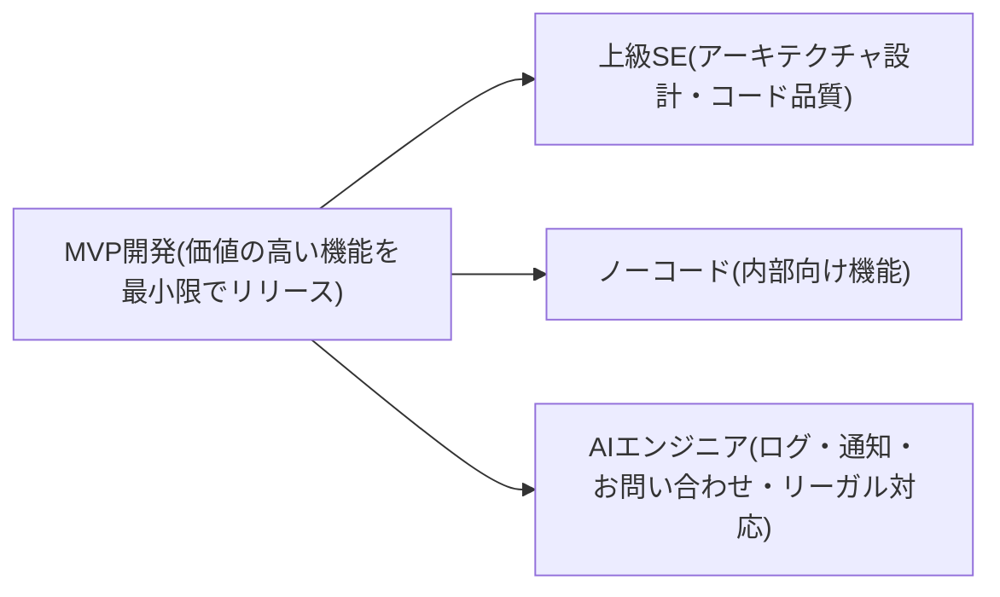

MVP開発の中にある上級SEとノーコードとAIエンジニアというテーマで文章を書いてください。

以下、私の考えていることです。

1.MVP開発は必要な機能を最小限に絞り込み開発・リリースを行う。
2.しかしMVPといってもシステム開発には以下のような要素がある
  - ユーザへの提供価値: どれだけユーザに価値を提供できるか
    - 多い, 普通, 少ない, ない(内部向け)
  - 開発工数: 開発にかかる工数
    - 多い, 普通, 少ない, ない(内部向け)
  - 重要度
    - 必須, 重要, 任意

例えばビジネス上、ターゲットユーザに提供する価値がもっとも多い部分がMVPの開発対象となる。

しかしそれとは別に
  - システム上必須/重要な機能
    - 監視, セキュリティ, ログ, バックアップ
  - ビジネス上必須/重要な機能
    - 会員登録, お問い合わせ, お知らせ, リーガル対応
  - 内部向けの機能
    - 運用, マスタデータ作成, モニタリング, ログ解析, バッチ処理
といった機能も必要になる。

ここに最新の開発手法との関わり方がある。

上級SEはMVP開発の中心部分に時間と能力を注ぐ。
何をMVPにするのか、それを運用保守がしやすいアーキテクチャを設計し、詳細なコードまでこだわりを持つ。

一方でその他の内部向けの機能はノーコードを利用する。
マスタデータの作成やちょっとしたバッチ、データのインポートや
スタッフの管理などはノーコードで作成することで、開発工数を削減する

システム側に持つ必要がある機能はAIエンジニアが担当する。
ログの整形や通知処理、問い合わせやお知らせ機能、法律上必須となる文言の追加など。

よって私たちのSEはMVP開発を自律的にまわし、ノーコードとAIエンジニアを活用することで
これまでの3~5人分のエンジニアに相当する開発を1人で行うことができる。

---

MVP開発における上級SE、ノーコード、AIエンジニアの活用について

MVP（Minimum Viable Product）開発とは、必要な機能を最小限に絞り込み、迅速に開発・リリースを行うことである。しかし、単純に最小限の機能に絞るだけでは不十分であり、実際のシステム開発には以下のような複数の要素を考慮する必要がある。

- ユーザへの提供価値（多い、普通、少ない、ない［内部向け］）
- 開発工数（多い、普通、少ない、ない［内部向け］）
- 機能の重要度（必須、重要、任意）

この中で最もユーザへの提供価値が高く、ビジネス上の成果につながる機能がMVP開発の中心的な対象となる。

しかし、実際には以下のような他の機能も重要になる。

- システム上必須/重要な機能（監視、セキュリティ、ログ、バックアップ）
- ビジネス上必須/重要な機能（会員登録、お問い合わせ、お知らせ、リーガル対応）
- 内部向け機能（運用、マスタデータ作成、モニタリング、ログ解析、バッチ処理）

これらの機能を効率的に実装するために、最新の開発手法を適切に使い分けることが重要となる。

上級SEはMVP開発の中核を担い、価値の高い機能を見極め、それを運用・保守しやすいアーキテクチャとして設計する。また、品質の高いコードを作成することで、システムの長期的なメンテナンス性を確保する。

一方で、内部向けの機能（マスタデータの作成やデータインポート、スタッフ管理など）はノーコードツールを活用して迅速に構築し、開発工数を大幅に削減する。

さらに、システムとして必須のログ処理や通知処理、お問い合わせ対応やリーガル対応などの機能はAIエンジニアが担当し、AI技術を活用して効率化を図る。

このように、上級SEがMVP開発の中心部分に集中し、ノーコードとAIエンジニアを効果的に活用することで、従来なら3〜5人必要だった開発体制を1人で回すことが可能になる。最新の開発手法を柔軟に取り入れることで、小規模チームでも最大限の成果を実現できる。

---

## 自分のコメント
- ユーザへの提供価値（Value）
- 開発工数（Cost）
- 機能の重要性（Priority）

x

- 運用視点（Operation）
- ビジネス視点（Sales）
- 運営視点（Promotion）

---

## ChatGPT Work for creating a flowchart

