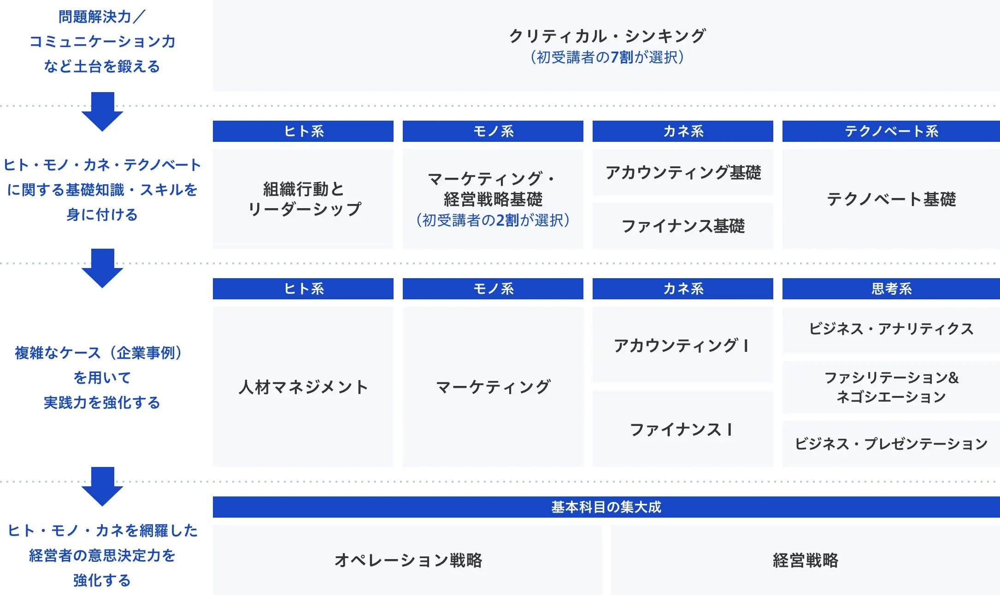

# 経営学を学んだ人視点での営業活動とは？(eaba011f42)
- そもそも、経営学を学ぼう
  - グロービス経営大学院を調べよう
    - グロービス学び放題
    - グロービス経営大学院（MBA学位の取得）
    - ２つがあるらしい
- 学位は必要か？
  - 不要
    - 学位そのものは不要。実践できればそれでよい。
    - どこかの企業に転職するのであれば、学位の取得は検討したい。
  - 必要
    - 学位そのものが必要なのではなく、
    - そのコミュニティや、学びの場に行くこと自体に、価値がある（だろう）
    - そのコスパはどのくらいだろうか？
- まずは、グロービス学び放題で十分ではないか？

## グロービス学び放題
https://globis.jp/

## グロービスMBAのカリキュラム

### Lv1. 土台
#### 問題解決力／コミュニケーション力
クリティカル・シンキング

### Lv2. 基礎知識・スキル
#### ヒト系
組織行動とリーダーシップ
#### モノ系
マーケティング・経営戦略基礎
#### カネ系
アカウンティング基礎
ファイナンス基礎
#### テクノベート系
テクノベート基礎

### Lv3. 複雑なケース（企業事例）を用いて、実践力を強化
#### ヒト系
人材マネジメント
#### モノ系
マーケティング
#### カネ系
アカウンティング１
ファイナンス１
#### 思考系
ビジネス・アナリティクス
ファシリテーション＆ネゴシエーション

### Lv4. 経営者の意思決定力を強化
オペレーション戦略
経営戦略

